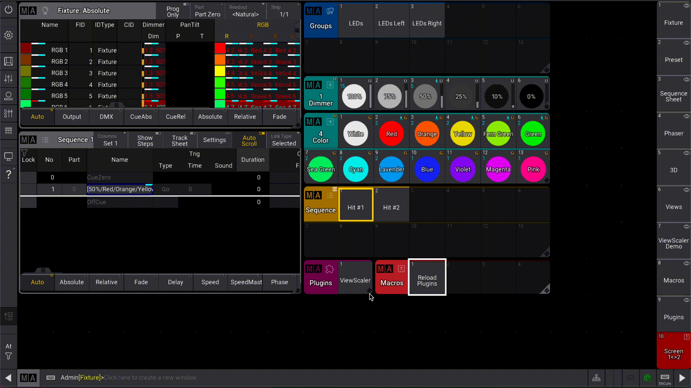
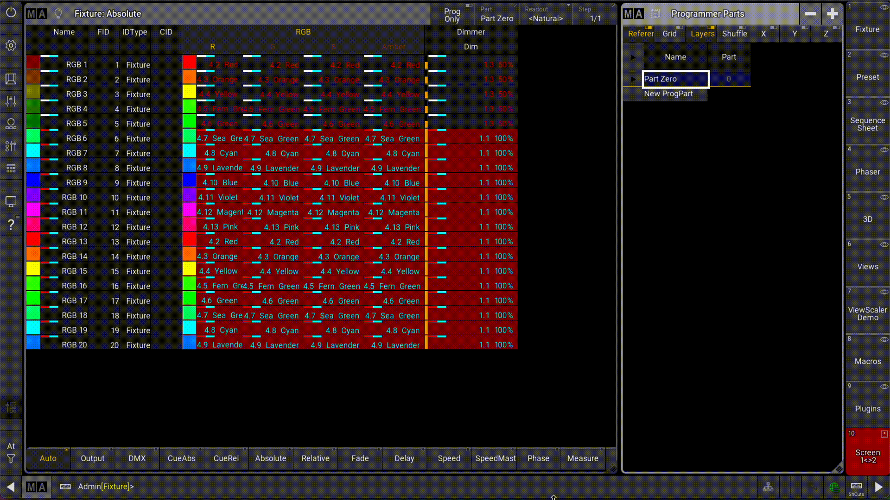

# GrandMA3 plugins

A collection of GrandMA3 plugins and experiments

- [ViewScaler](#viewscaler): Scale a display's content to fit the available space.
- [ScreenSwap](#screenswap): Swap the ViewButtons between 2 displays

## Installation

- Download latest version from the [Package Registry](https://gitlab.com/patopest/grandma3-plugins/-/packages) or the [Releases](https://gitlab.com/patopest/grandma3-plugins/-/releases) page.
- Unzip the file in the `gma3_library/datapools/plugins/` folder of your MA installation:
    - macOS: `~/MALightingTechnology/...`
    - Windows: `C:\ProgramData\MALightingTechnology\...`
    - USB key: `/grandMA3/...`
- In your showfile, import the plugin in a new `Plugin` pool object.

## Plugins

### [ViewScaler](./ViewScaler)

Scale a display's content to fit the available space.

This plugin came as a need to handle the views on different screen sizes when using multiple platforms: onPC, Compact(XT) or Lite/Full consoles.

### [ScreenSwap](./ScreenSwap)

Swap `ViewButtons` between 2 screens.

- Easily access a 2nd bank of ViewButtons for your screen in one-click.
- Move around stored views between displays.
- Access views stored on unavailable displays in your showfile. ex: Showfile was built on Full Console but currently running on Lite Console and missing Display 3.

## References / Documentation

- Official UserManual [v2.0](https://help.malighting.com/grandMA3/2.0/HTML/plugins.html)
- Unofficial documentation [github](https://github.com/hossimo/GMA3Plugins/wiki)
- Unofficial TypeScript [types](https://github.com/LightYourWay/grandMA3-types/tree/main)