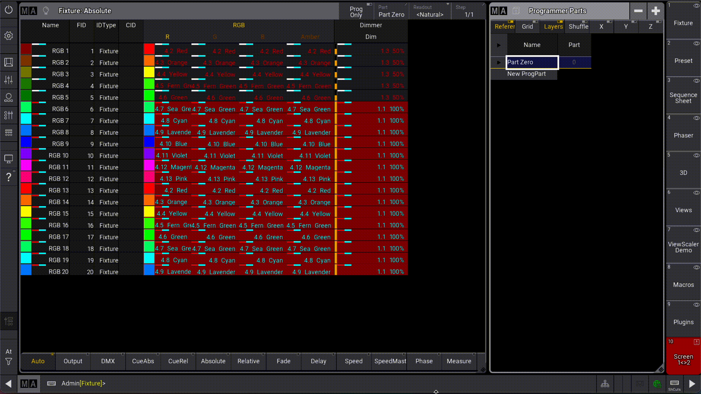

# ScreenSwap

[](https://gitlab.com/patopest/grandma3-plugins/-/packages)
[](https://www.malighting.com/grandma3/)


Swap `ViewButtons` between 2 screens.

- Easily access a 2nd bank of ViewButtons for your screen in one-click.
- Move around stored views between displays.
- Access views stored on unavailable displays in your showfile. ex: Showfile was built on Full Console but currently running on Lite Console and missing Display 3.





## Usage

Arguments:

- `/Screen A`: First screen (optional, default: 1)
- `/Screen B`: Second screen (optional, default: 2)
- `/Buttons X Thru Y`: The range of `ViewButtons` to swap (optional, default: "1 Thru 10")

Examples:

- Swap buttons 1 to 10 between screen 1 and 2:

```lua
Plugin "ScreenSwap"
-- OR
Plugin "ScreenSwap" "/Screen 1 /Screen 2 /Buttons 1 Thru 10"
```

- Swap all buttons starting from #5 onwards between display 1 and 2:

```lua
Plugin "ScreenSwap" "/Buttons 5 Thru"
```

- Swap all visible buttons (1 to 10 on Lite/Full console) between display 2 and 3

```lua
Plugin "ScreenSwap" "/Screen 2 /Screen 3"
```
